

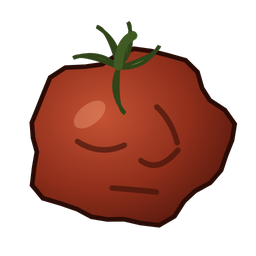

# Deadlock Mods

**HUD Fit · 4:3 Video · Hero Select Plus**

De-stretch and scale the Deadlock HUD and shop, add a 4x3 aspect ratio, and find heroes faster.
Free, and the three work together.

[HUD Fit](#-hud-fit) · [4:3 Video](#-43-video) · [Hero Select Plus](#-hero-select-plus) · [Install](#-install) · [FAQ](#-faq)

<table>
<tr>
<td width="33%" align="center"><a href="#-hud-fit">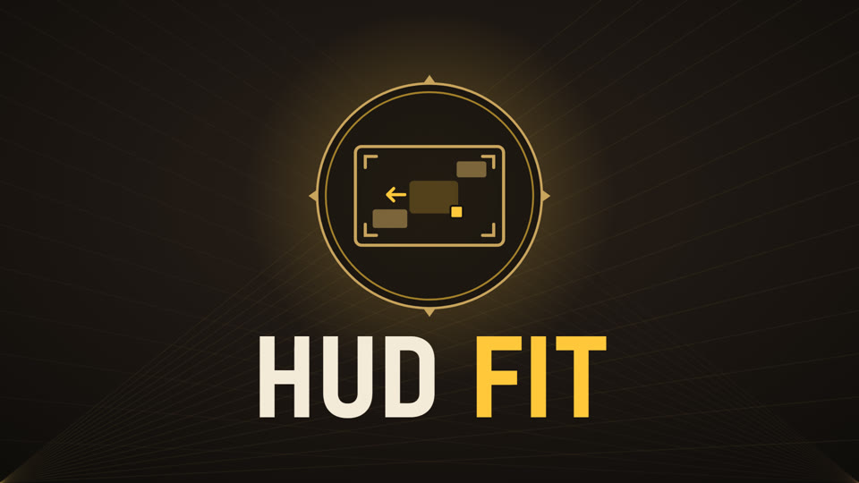</a> <b>HUD Fit</b> De-stretch, scale and move the HUD</td>
<td width="33%" align="center"><a href="#-43-video">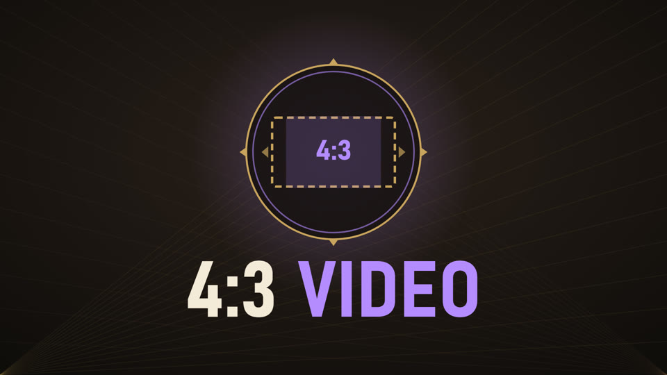</a> <b>4:3 Video</b> 4x3 aspect ratio in the video settings</td>
<td width="33%" align="center"><a href="#-hero-select-plus">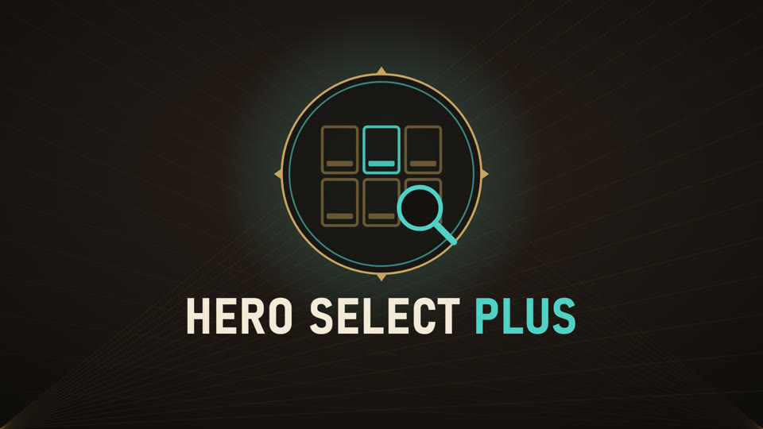</a> <b>Hero Select Plus</b> Hero names, classes, search and filters</td>
</tr>
</table>

---

## 🟨 HUD Fit

**De-stretch, resize and move the Deadlock HUD, live in game.**

HUD Fit is an in-game HUD editor. It is made for **4:3 stretched** players, but it works at any
resolution (16:9, 16:10, 5:4, 21:9). Playing stretched makes the HUD look wide and blurry, and HUD
Fit makes it look right again. You can also make the UI bigger or smaller, or move pieces of it out
of the way.

<!--dl:hudfit--><!--/dl-->

| Before: the stock HUD at 4:3 stretched | After: de-stretched and resized with HUD Fit |
|:---:|:---:|
| 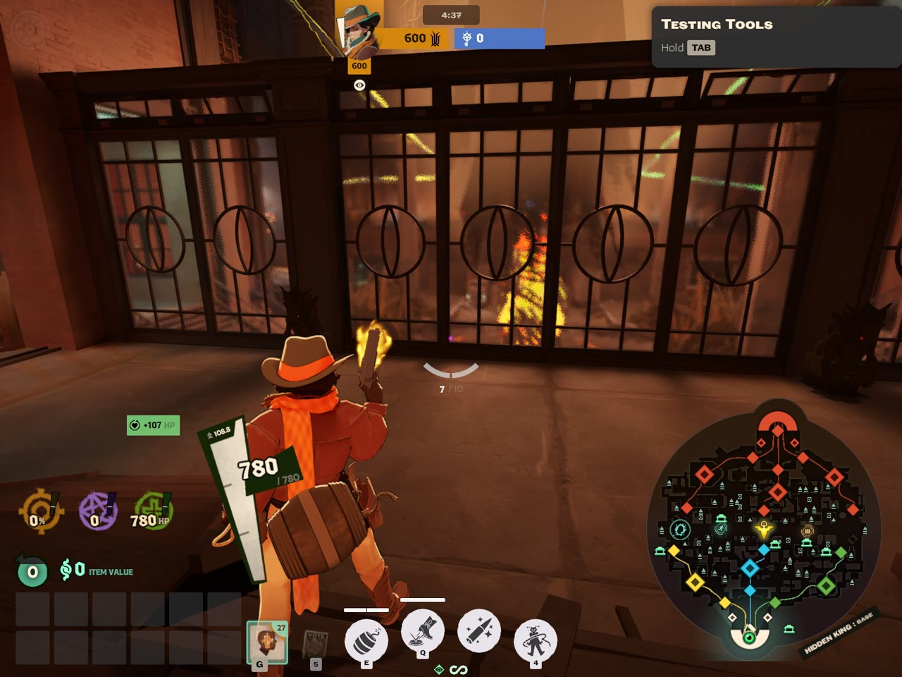 | 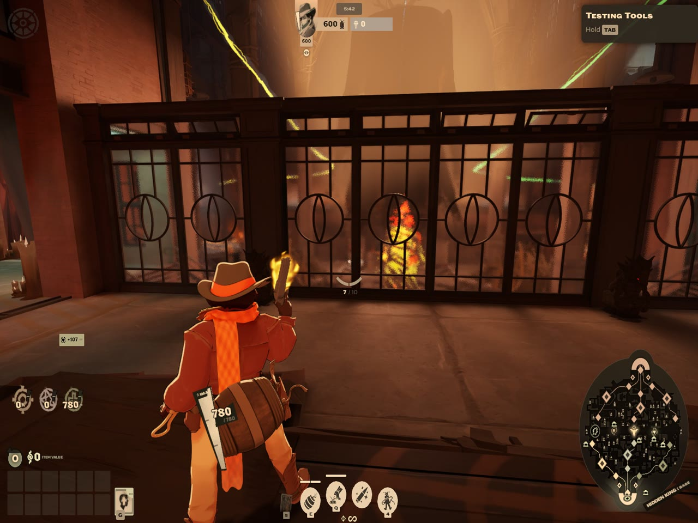 |

### Features

| | |
|---|---|
| 📐 **De-stretch for 4:3 stretched** | Fix chosen elements or the whole HUD, with presets for 4:3, 5:4 and 16:10 |
| 🔍 **Scale the UI** | Make the whole HUD bigger or smaller, and every element stays at its screen edge. Each element can also be resized on its own |
| 🛒 **Scale the shop (buy menu)** | Resize and de-stretch the buy menu so it fits a 4:3 screen or a smaller UI |
| ✋ **Move 23 HUD elements** | Health bar, abilities, items & souls, weapon / spirit / vitality, minimap, top bar, crosshair & ammo, kill feed, chat, buy menu, prompts, buffs, aura effects, hints, announcements, respawn timer, damage meter, movement speed and more |
| 🧲 **Snapping and centering** | Snap to screen edges, the centre and other elements. Center buttons put the crosshair exactly in the middle. W A S D nudges an element (Shift = 10 px) and + / − resizes it |
| 🗂️ **Layers** | Show or hide each element, lock it, or reset it with one click |
| ❤️ **Health bar fix** | The stock health bar disappears at 4:3; HUD Fit puts it back |
| 🧪 **Test tab** | One-click sandbox situations so you can arrange the real UI: damage, low health, death / respawn timer, level up, souls, buffs, enemy bot, trooper wave, DPS meter |
| 💾 **Layouts** | Default, Clean, and up to 20 named layouts. Export or import a layout code to share it |
| 🎨 **Filters** | Monochrome, Sepia, Neon, Ice, Ghost, Focus and Muted, each with a strength slider |
| 🔒 **Saved on your PC** | Your layout comes back after a restart, and nothing is uploaded |

**Open it:** press Esc in a match, then choose **HUD Fit** (under Settings). Explore NYC or a sandbox /
Hero Testing match is the best place to use it.

<b>📸 More screenshots</b>

 

**The editor opens over the live HUD**
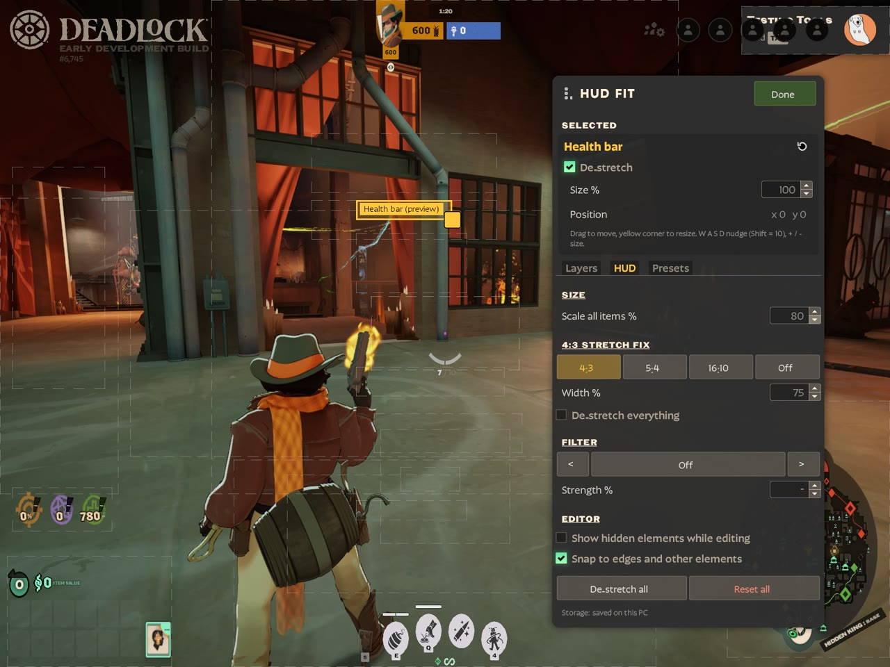

**Layers: show, hide, lock or reset every element**
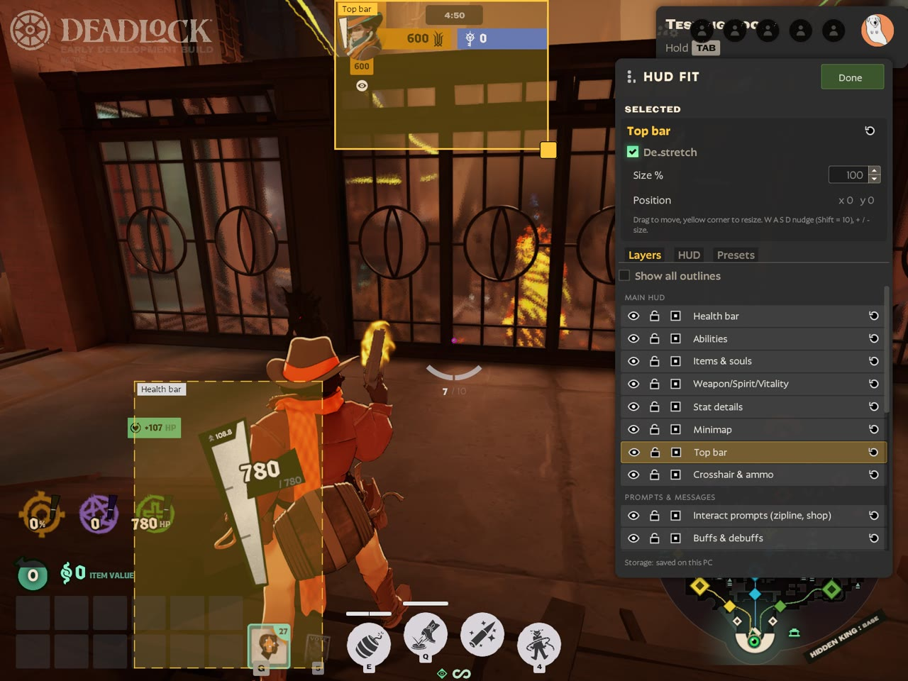

**Show all outlines: every element you can move and resize**
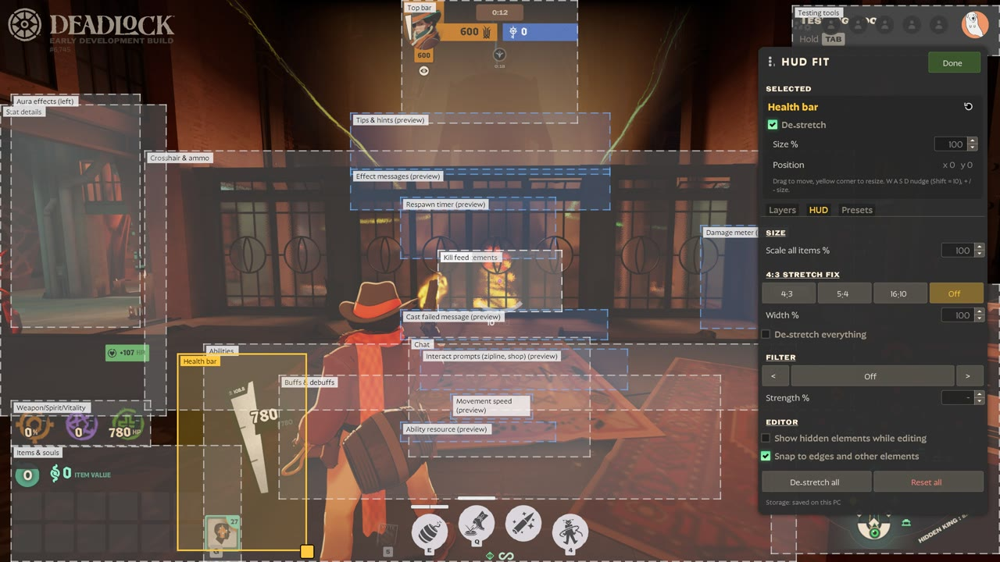

---

## 🟪 4:3 Video

**A 4x3 aspect ratio option for Deadlock's video settings.**

This mod adds a **4x3** choice to **Settings → Video → Aspect Ratio**, next to 16:9, 16:10 and 21:9.
Pick it and the resolution list shows the 4:3 resolutions your graphics driver offers, for example
1600x1200, 1440x1080 or 1280x960.

<!--dl:aspect43--><!--/dl-->

- ✅ **Never hides new settings.** Older 4:3 mods ship a whole copy of the settings screen, which hides
  every setting added since. This one only adds the button.
- 🔁 **Remembers your choice:** 4x3 stays selected when you reopen the settings.
- 🖥️ **Want 1920x1440?** Add it as a custom resolution first, in AMD Adrenalin, the NVIDIA Control
  Panel or CRU, and it shows up in the list.
- 🤝 **Made to be used with HUD Fit**, which de-stretches the HUD when you play 4:3 stretched.

---

## 🟦 Hero Select Plus

**Learn the Deadlock heroes faster.**

Hero Select Plus makes the hero select screen easier to read, especially for new players.

<!--dl:heroselect--><!--/dl-->

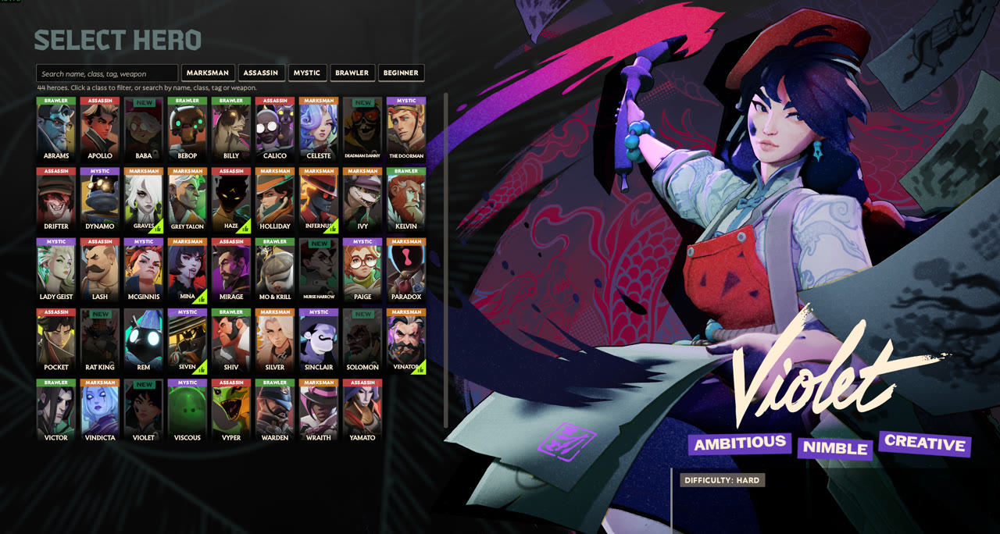

- 🏷️ **Names and classes** on every hero card, colour coded: Marksman, Assassin, Mystic, Brawler.
- 🔎 **Search** by name, class, tag, weapon type or difficulty. Several words narrow it down, for
  example "brawler tank".
- 🎚️ **Class filters**, plus a **Beginner** button for the heroes the game recommends to new players.
- 💬 **Hover details:** class, difficulty, weapon type, a one-line role and a playstyle summary.

<b>📸 Close-up</b>

 
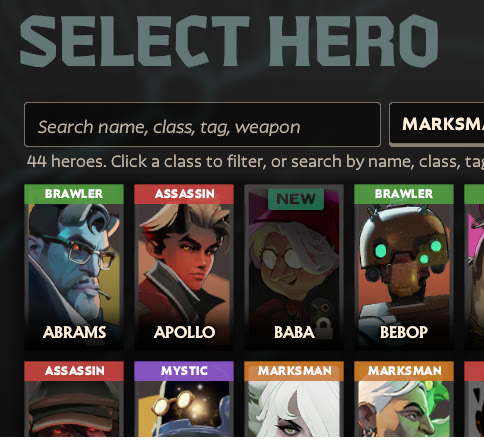

---

## 📦 Install

Download a mod's zip from **https://greeb.github.io/mods/** (or the buttons above), then:

| | |
|---|---|
| **Deadlock Mod Manager** (easiest) | Choose **Add Local Mod**, drop the zip in (don't unzip it), add it and turn it on |
| **Grimoire** | Open **Installed** → **Import Local Mods**, pick the zip and turn the mod on |
| **By hand** | Unzip it, copy `pak01_dir.vpk` to `Deadlock/game/citadel/addons` and rename it to the next free number (`pak02_dir.vpk`, ...). Mods must be enabled in `gameinfo.gi`; a mod manager does this for you |

**Updating:** remove the old version in your mod manager, then add the new zip.
After a big game update, if something looks wrong, turn the mod off until an updated version is
posted.

---

## ❓ FAQ

<b>How do I de-stretch the HUD when playing Deadlock 4:3 stretched?</b>

Install HUD Fit, press Esc → HUD Fit, open the **HUD** tab and pick the **4:3** stretch preset. Then
turn on **De-stretch everything**, or de-stretch only the elements you choose.

<b>How do I make the Deadlock UI or shop smaller (or bigger)?</b>

In HUD Fit, use **Scale all items** in the HUD tab for the whole HUD. To resize one element, select
it (for example **Buy menu (shop)** under Layers) and change **Size %**, or drag its corner handle.

<b>How do I get a 4:3 resolution in Deadlock?</b>

Install 4:3 Video, then pick **4x3** under Settings → Video → Aspect Ratio. If the resolution you
want isn't listed, add it as a custom resolution in your graphics driver first.

<b>Do these mods work together?</b>

Yes. They change different game files. HUD Fit conflicts with other mods that replace
`base_hud` or `hud_escape_menu`, and Hero Select Plus conflicts with other hero select mods.

---

 
Made by dirtytomat0, with AI. Not affiliated with Valve. 
Questions or bugs: <a href="https://github.com/GREEB/mods/issues">open an issue</a>. 
<i>The download page is generated: <code>python3 build_site.py</code> copies the latest release zips and
images into <code>docs/</code> (GitHub Pages) and refreshes the download buttons in this README.</i>

